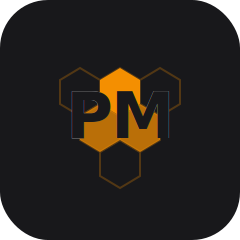
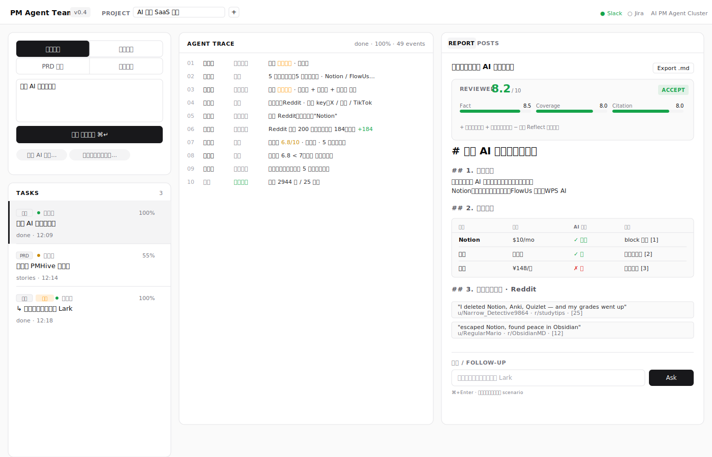
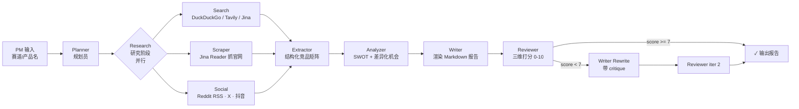
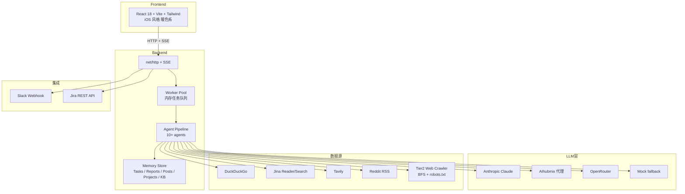

<div align="center">
  

  <h1>PM Agent Team</h1>

  <p><strong>AI 产品经理 · 多 Agent 集群</strong></p>

  <p>让 PM 30 秒拿到原本 2 天的调研产出 —— 竞品 / 访谈 / PRD / 社聆 一站式</p>

  <p>
    
    
    
    
    
    
  </p>

  
</div>

---

## 解决什么问题

中国 / 出海 SaaS 团队的 PM 每周有 **60% 工时**消耗在三件重复劳动里：

| PM 痛点 | 人工耗时 | PM Agent Team 解决方案 |
|---|---|---|
| 🔍 **竞品调研** — 横向扫赛道 / 抓官网 / 看用户口碑 / 写矩阵 | 单次 1-3 天 | 多 Agent 并行 (搜索+抓取+社聆)，2 分钟出带引用的结构化报告 |
| 🎙 **用户访谈分析** — 转写 / 打标 / 聚类 / 提需求 | 10 场访谈 ~ 1 周 | LLM 自动主题聚类 + 频次统计 + 原话引用 |
| 📝 **PRD 起草** — 背景 / 目标 / 用户故事 / 验收标准 | 单份 0.5-1 天 | 一句话需求 → 结构化 PRD 草稿，含 4-6 user stories + 验收标准 |
| 📡 **社区聆听** — 跟踪用户在 Reddit / 抖音 / X 上的真实声量 | 几乎不做 | 跨平台批量抓帖 (1000+/任务) + 相关性过滤 |

**为什么是「Agent 集群」而不是「Claude 套壳」**：

- ⚙️ **多 Agent 真协作**：调度员 → 规划员 → 搜索员 + 抓取员 + 社聆员 (并行) → 结构化员 → 分析员 → 撰写员 → **复审员** (打分) → **自校正重写** (分数 < 7 自动 retry)
- 🧠 **跨任务长期记忆**：项目空间 (Project) 把多个相关 task 归到一起，新任务自动召回历史调研作为上下文
- 🔄 **追问增量执行**：报告完成后追问「再加一家 Lark」→ child task 跑完自动 merge 回 parent 报告
- 🔌 **工具链嵌入**：Slack 推卡片 / Jira 自动建 issue / webhook 接收 issue.created 触发 PRD 起草

---

## 截图



> 三栏布局：左侧任务列表 + 项目选择 / 中间 Agent 实时协作流（中文化叙事） / 右侧报告 + Reviewer 评分 + 追问框

---

## 技术架构

### 多 Agent 编排（竞品调研流水线为例）



### 系统架构



### 技术栈

| 层 | 选型 | 理由 |
|---|---|---|
| **后端语言** | Go 1.22+ 标准库 net/http | 多 Agent 并发原生优势；零额外中间件 |
| **LLM 路由** | Anthropic / AIhubmix / OpenRouter (auto-fallback) | 海外+国内+多模型切换；mock 兜底零外部依赖跑 demo |
| **任务队列** | Memory worker pool (River-ready) | 零依赖开箱跑；接口预留可切 PostgreSQL + River |
| **数据存储** | Memory store (PG-ready) | KB / Posts / Tasks 三层存储；接口为 PG 升级预留 |
| **搜索** | DuckDuckGo HTML / Tavily / Jina (with relevance filter) | 免费默认 + 可选付费升级；query 自动双语扩展 |
| **抓取** | Jina Reader (`r.jina.ai/{url}`) | 免费、AI-friendly markdown 输出 |
| **社交聆听** | Reddit Atom RSS · X / Douyin / TikTok / YouTube (stub + key) | Reddit 默认开 (无 key)；其他平台配 key 即接入 |
| **简易爬虫** | 自研 BFS crawler (robots.txt + per-domain 限速) | 受礼貌爬取约束；可独立做行业页面快照 |
| **流式协议** | Go 标准库 SSE | 比 WebSocket 简单一个数量级；自动断线重连 |
| **前端框架** | Vite + React 18 + TypeScript strict | 0 ESLint 警告 / TS strict |
| **UI 风格** | Tailwind 3 + Linear/Vercel 风专业灰白 | 中文化 trace + 评分进度条 + 追问框 |

---

## 30 秒 Quickstart

### 0. 拉代码

```bash
git clone https://github.com/PLA-yi/PM_Agent_Team.git
cd PM_Agent_Team
```

### 1. 配置（最少配置：什么都不填也能跑）

```bash
cp .env.example .env
# 推荐填：AIHUBMIX_API_KEY=sk-...   (国内代理 Claude，最快)
#       或 ANTHROPIC_API_KEY=sk-ant-... (直连)
#       或 OPENROUTER_API_KEY=...       (海外多模型)
# 不填任何 key → 走 mock 模式，仍可演示完整 UI 链路
```

### 2. 启动后端 (`:8080`)

```bash
set -a && source .env && set +a
cd server && go run ./cmd/server
```

看到这行就 OK：
```
PMHive listening on :8080
  LLM:    mock=false   model=claude-sonnet-4-5
  Search: mock=false   provider=duckduckgo→mock(fallback)
  Scrape: mock=false   provider=jina_reader
  Social: authed=[reddit]
```

### 3. 启动前端 (`:5173`)

```bash
cd web && npm install && npm run dev
```

### 4. 用

打开 `http://localhost:5173`，左上选场景（竞品 / 访谈 / PRD / 社聆），输入需求，⌘+Enter 启动。

---

## 4 大场景示例

| 场景 | 输入示例 | 真实耗时 | 产出 |
|---|---|---|---|
| 🔍 **竞品调研** | `国内 AI 笔记类产品` | 90s - 3min | 竞品矩阵 + SWOT + 用户真实声量 + 1000+ Reddit 帖子落库 |
| 🎙 **访谈分析** | 粘贴访谈转写（多段空行分隔） | ~1 min | 主题聚类 + 频次 + 原话引用 + 需求列表（带置信度） |
| 📝 **PRD 起草** | `做一个用户反馈悬浮按钮` | ~1.5 min | 完整 PRD：背景 / 目标 / 用户故事 / 验收标准 / 风险 |
| 📡 **社交聆听** | `Cursor IDE` | ~1 min | Reddit 跨主题聚类，洞察+需求列表 |

---

## 项目结构

```
PM_Agent_Team/
├── README.md            # 本文档
├── docker-compose.yml   # postgres + pgvector (生产路径，v0.5+)
├── .env.example         # 配置模板
├── Makefile
├── docs/
│   └── data-pipeline.md # v0.7 数据壁垒设计
├── assets/              # logo / banner / screenshots
├── server/              # Go 后端
│   ├── cmd/
│   │   ├── server/      # HTTP server 入口
│   │   └── scrape-demo/ # 爬虫独立 CLI demo
│   ├── internal/
│   │   ├── api/         # HTTP + SSE handler
│   │   ├── agent/       # 10+ Agent (planner/search/scraper/social/extractor/analyzer/writer/reviewer/...)
│   │   ├── llm/         # Anthropic / AIhubmix / OpenRouter / Mock
│   │   ├── tools/       # DDG / Tavily / Jina / Mock
│   │   │   └── social/  # Reddit (RSS) + X / Douyin / TikTok / YouTube stubs
│   │   ├── crawler/     # Tier2 BFS web crawler (robots.txt + rate limit)
│   │   ├── integrations/
│   │   │   ├── slack/   # Slack incoming webhook client
│   │   │   └── jira/    # Jira REST API client
│   │   ├── store/       # Memory store (PG-ready interface)
│   │   ├── jobs/        # Worker pool
│   │   └── stream/      # SSE event bus
│   └── migrations/      # 001_init.sql (生产路径预留)
└── web/                 # React 前端
    ├── src/
    │   ├── App.tsx
    │   ├── components/
    │   │   ├── TaskList.tsx
    │   │   ├── AgentTimeline.tsx   # 中文化 agent 协作流
    │   │   ├── ReportPreview.tsx   # 报告 + Reviewer 评分卡 + 追问框
    │   │   └── PostsViewer.tsx     # 1000+ posts 表格 + 筛选
    │   └── lib/api.ts
    └── tailwind.config.js
```

---

## 已实现里程碑

- [x] **v0.1** — MVP 端到端：竞品调研单场景 demo，mock 模式开箱即跑
- [x] **v0.2** — 访谈分析 + PRD 起草，4 场景闭环
- [x] **v0.3** — 真实 LLM (Anthropic / AIhubmix / OpenRouter) 全打通
- [x] **v0.4** ⭐ — 当前版本
  - Reviewer Agent + Self-correction loop（评分 < 7 自动重写一轮）
  - Project 项目空间 + 跨任务知识库（KB 注入新任务上下文）
  - 真增量追问（child task 完成自动 merge 回 parent 报告）
  - Slack incoming webhook + Jira REST client + webhook receiver
  - 1000+ Reddit posts/任务（多 sort × 多时间窗 + 相关性过滤）
  - 中文化 Agent Trace（13 agent 角色 + 14 stage + 10 engine 全中文）
  - iOS 风专业 UI

## Roadmap

- [ ] **v0.5** — pgvector 升级 KB（embedding-based RAG，跨任务召回质量翻倍）
- [ ] **v0.6** — Eval 飞轮（A/B prompt 框架 + 周回放 100 sample）
- [ ] **v0.7** — 多模态（截图 OCR / PDF 解析 / 录音转写）
- [ ] **v0.8** — 团队协作（多用户 / 评审流 / 评论 / changelog）
- [ ] **v0.9** — 行业数据管道（ProductHunt / HN / GitHub / Crunchbase 定时 ingest）
- [ ] **v1.0** — 公开 Beta + 落地页 + 计费

详细设计：`docs/data-pipeline.md`

---

## API 速查

| 方法 | 路径 | 说明 |
|---|---|---|
| `GET` | `/healthz` | 健康检查 |
| `POST` | `/api/tasks` | 创建任务 `{scenario, input, project_id?}` |
| `GET` | `/api/tasks` | 任务列表 |
| `GET` | `/api/tasks/{id}` | 任务状态 |
| `GET` | `/api/tasks/{id}/stream` | **SSE** 实时事件流 |
| `GET` | `/api/tasks/{id}/report` | 报告 + sources + metadata.review |
| `GET` | `/api/tasks/{id}/posts` | 社交平台帖子列表（支持 platform/q/limit/offset 筛选） |
| `POST` | `/api/tasks/{id}/followup` | 追问 → spawn child task |
| `POST` | `/api/projects` | 创建项目 |
| `GET` | `/api/projects` | 项目列表 |
| `GET` | `/api/projects/{id}/tasks` | 项目下任务 |
| `POST` | `/api/integrations/slack/notify` | 推 Slack 卡片 |
| `POST` | `/api/integrations/jira/issue` | 创建 Jira issue |
| `POST` | `/api/webhooks/jira` | 接收 Jira issue.created → 自动起草 PRD |
| `GET` | `/api/integrations/status` | 集成配置状态 |

---

## 测试

```bash
cd server && go test ./... -race          # 全 race-clean
cd web && npx tsc -b                       # TypeScript strict 0 警告
cd web && npx vite build                   # 生产构建
```

---

## 配置

`.env` 关键变量：

| 变量 | 默认 | 说明 |
|---|---|---|
| `LLM_PROVIDER` | auto | `anthropic` / `aihubmix` / `openrouter` / 留空 auto |
| `AIHUBMIX_API_KEY` | — | AIhubmix 代理 key（推荐：国内可用） |
| `ANTHROPIC_API_KEY` | — | 直连 Anthropic key |
| `OPENROUTER_API_KEY` | — | OpenRouter key |
| `LLM_MODEL` | `claude-sonnet-4-5` | LLM model id |
| `MOCK_MODE` | `auto` | `auto` / `always` / `never` |
| `TAVILY_API_KEY` | — | Tavily 搜索 key（可选） |
| `SLACK_WEBHOOK_URL` | — | Slack incoming webhook |
| `JIRA_BASE_URL` / `JIRA_EMAIL` / `JIRA_API_TOKEN` | — | Jira 集成三件套 |
| `X_BEARER_TOKEN` / `DOUYIN_COOKIE` / `TIKTOK_SESSIONID` / `YOUTUBE_API_KEY` | — | 社交平台 key（可选；不配则 stub） |

---

## License

MIT — see [LICENSE](./LICENSE)

---

<div align="center">
  <sub>Built with multi-agent collaboration · v0.4</sub>
</div>
